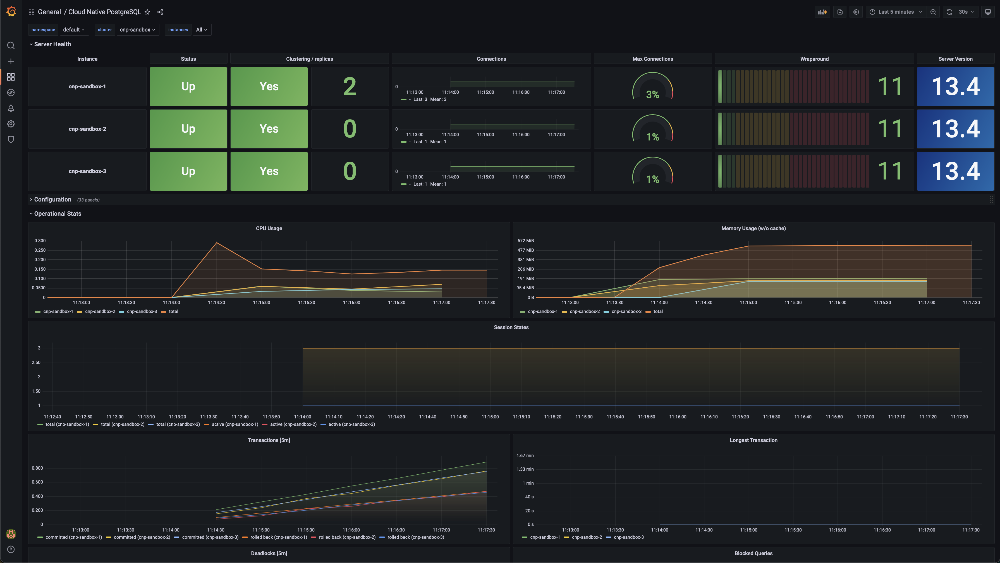

# Sandbox for Cloud Native PostgreSQL

Cloud Native PostgreSQL Sandbox, aka `cnp-sandbox`, is a Helm chart that
sets up the following components inside a Kubernetes cluster:

- [Prometheus](https://prometheus.io/)
- [Grafana](https://github.com/grafana/grafana)
- [Cloud Native PostgreSQL (CNP)](https://docs.enterprisedb.io/) by [EDB](https://enterprisedb.com/),
  a Kubernetes operator for [PostgreSQL](https://www.postgresql.org/) and
  [EDB Postgres Advanced](https://www.enterprisedb.com/products/edb-postgres-advanced-server-secure-ha-oracle-compatible), with:
    - a selection of PostgreSQL metrics for the native Prometheus exporter in CNP (see the [`metrics.yaml`](charts/cnp-sandbox/templates/metrics.yaml) template file)
    - a [custom Grafana dashboard](charts/cnp-sandbox/dashboard.json) developed by EDB for Cloud Native PostgreSQL

**IMPORTANT:** `cnp-sandbox` must be run in a staging or pre-production
environment. Do not use `cnp-sandbox` in a production environment, as we
expect that Prometheus and Grafana are already part of that infrastructure:
there you can install Cloud Native PostgreSQL, the suggested metrics and the
provided Grafana dashboard.



## Requirements

- Cloud Native PostgreSQL 1.10.0
- [GNU Make](https://www.gnu.org/software/make/) 3.8
- [Helm](https://helm.sh/) 3.7
- A supported Kubernetes cluster with enough RBAC permissions to deploy the required resources

## Deployment

Deployment using the latest release:

```console
helm repo add cnp-sandbox https://enterprisedb.github.io/cnp-sandbox/
helm repo update
helm upgrade --install cnp-sandbox \
  cnp-sandbox/cnp-sandbox
```

Then simply follow the instructions that will appear on the terminal once the
installation is completed.

#### Deployment from local source

You can deploy Cloud Native PostgreSQL Sandbox from local source with:

```console
make sandbox-deploy
```

You can remove the installed sandbox by running:

```console
make sandbox-uninstall
```

## Monitoring

From the Grafana interface, you can find the dashboard by selecting: `Dashboards` > `Manage` > `Cloud Native PostgreSQL`.

## Benchmarking

You can use `cnp-sandbox` in conjuction with
[`cnp-bench`](https://github.com/EnterpriseDB/cnp-bench) to benchmark your
PostgreSQL environment and observe its behaviour in real-time.

## Contributing

Please read the [code of conduct](CODE-OF-CONDUCT.md) and the
[guidelines](CONTRIBUTING.md) to contribute to the project.

## Disclaimer

`cnp-sandbox` is open source software and comes "as is". Please carefully
read the [license](LICENSE) before you use this software, in particular
the "Disclaimer of Warranty" and "Limitation of Liability" items.

## Copyright

`cnp-sandbox` is distributed under Apache License 2.0.

Copyright (C) 2021 EnterpriseDB Corporation.
